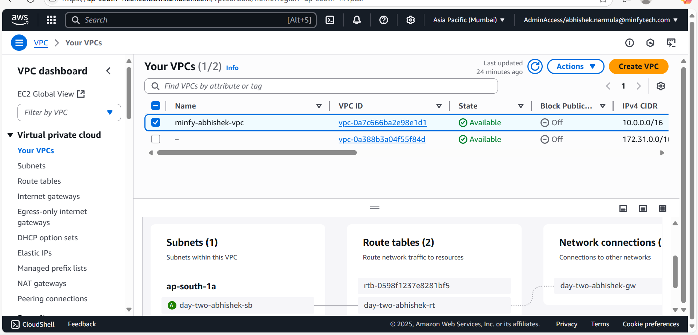
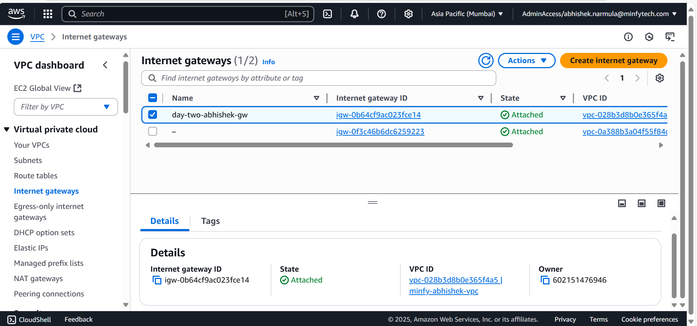
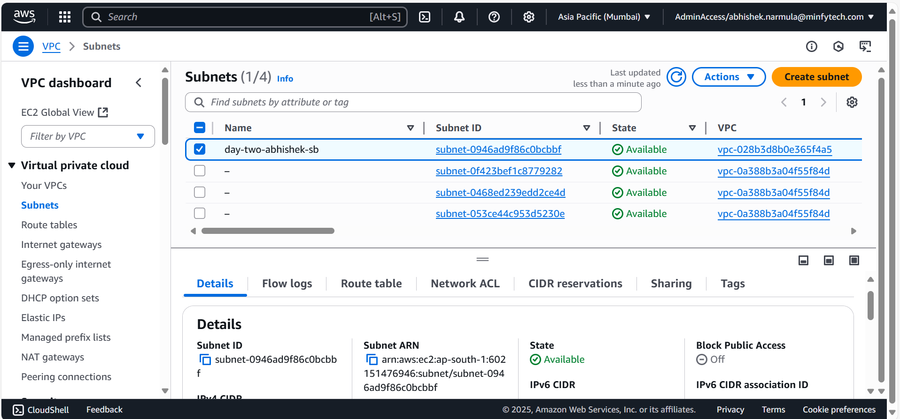
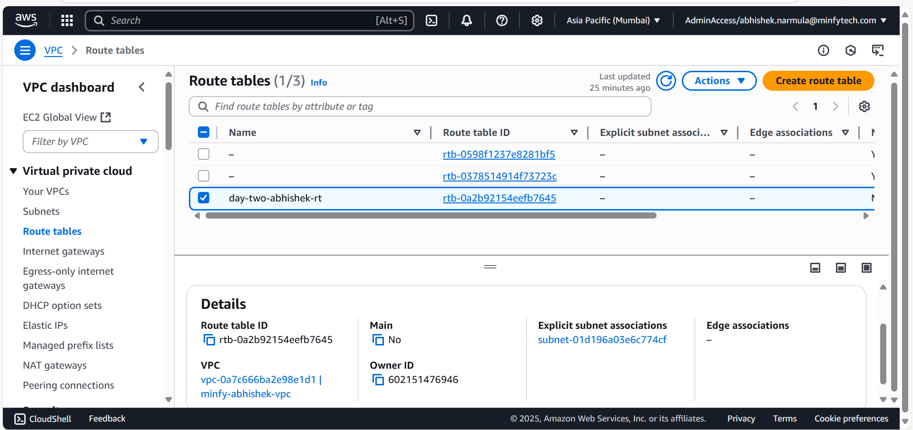
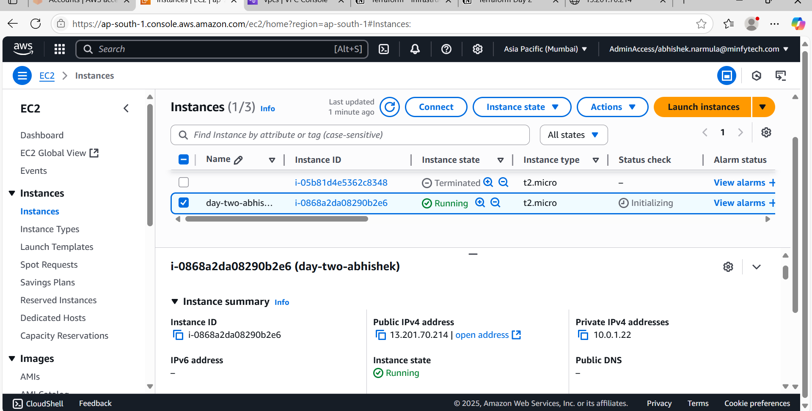
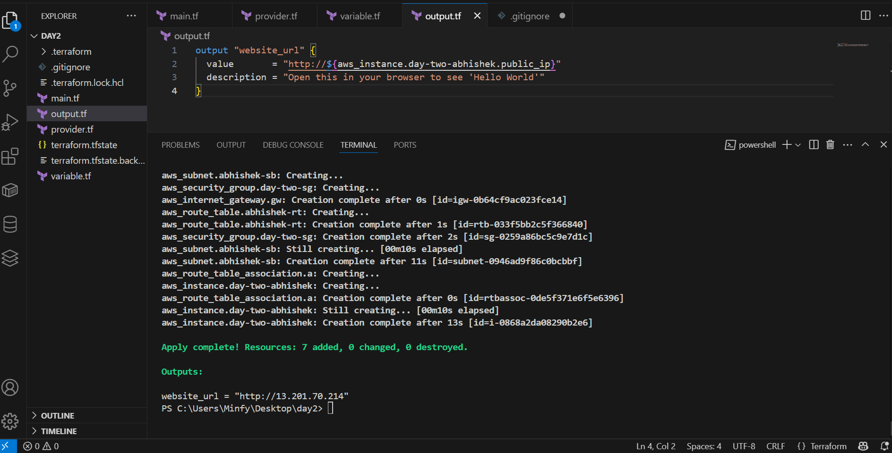
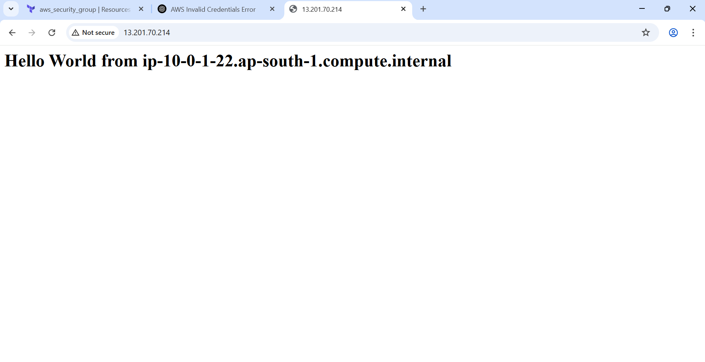

## TERRAFORM PRATICAL 
## PART 1
create a provider.tf in that provider block with aws and region with "ap-south-1"

then create main.tf 
## VPC
then create a VPC 
cidr="10.0.0.0/16"

## INTERNET GATEWAY
create a internet gateway
and attach the internet gateway to the VPC

## SUBNETS
create a subnet 
cidr_block         = "10.0.1.0/24"
availability_zone  = "ap-south-1a"
map_public_ip_on_launch = true
and tag 
name = day-two-abhishek-sb

## ROUTE TABLE
create a route table with
cidr_block = "0.0.0.0/0" ## allow all traffic 

## SECURITY GROUP
create a security group with
allow the HTTP and SSH inbounds
ingress {
    description = "HTTP"
    from_port   = 80
    to_port     = 80
    protocol    = "tcp"
    cidr_blocks = ["0.0.0.0/0"]
  }

  ingress {
    description = "SSH"
    from_port   = 22
    to_port     = 22
    protocol    = "tcp"
    cidr_blocks = ["0.0.0.0/0"]
  }

  egress {
    from_port   = 0
    to_port     = 0
    protocol    = "-1"
    cidr_blocks = ["0.0.0.0/0"]
  }

## EC2 INSTANCE
create a ec2 instance 
resource "aws_instance" "day-two-abhishek" {
  ami                    = "ami-0b09627181c8d5778"
  instance_type          = var.instance_type
  subnet_id              = aws_subnet.abhishek-sb.id
  vpc_security_group_ids = [aws_security_group.day-two-sg.id]
  associate_public_ip_address = true
}

## Advance details : user data script
 #!/bin/bash
              yum update -y
              yum install -y httpd
              systemctl start httpd
              systemctl enable httpd
              echo "<h1>Hello World from $(hostname -f)</h1>" > /var/www/html/index.html
            EOF

## CREATE A VARIABLE.TF
create a variable.tf in that 
create for aws_region with region : "ap-south-1"
and vpc_cdir with cidr ="10.0.0.0/16"
for instance_type with t2.micro

## OUTPUT.TF
in the output.tf file place the public ip 

## terraform commands 
firstly 
## terraform init
it will initilze the all files 

## terraform validate 
which will validate the syntax of resource 

## terraform plan 
command creates an execution plan
## terraform apply 
command executes the actions proposed in a Terraform plan
 ## final output 
 

