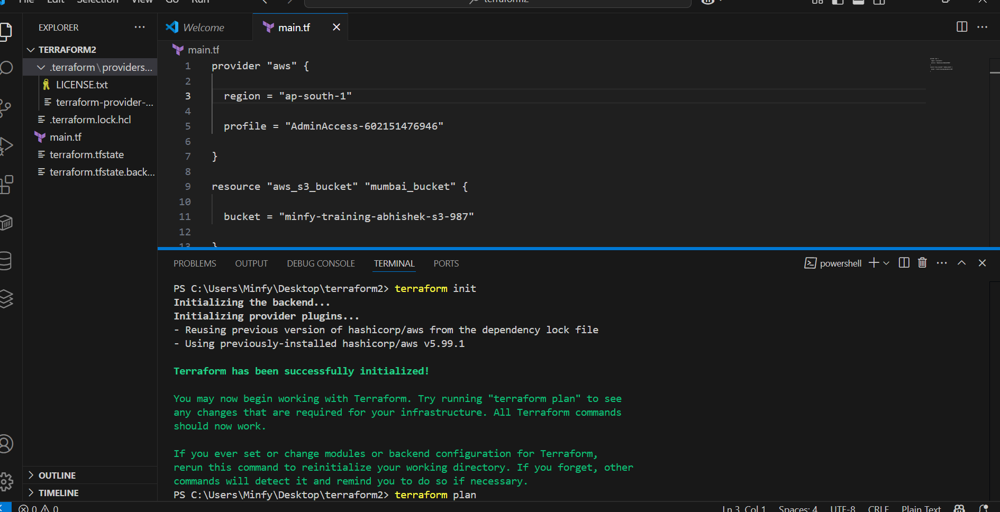
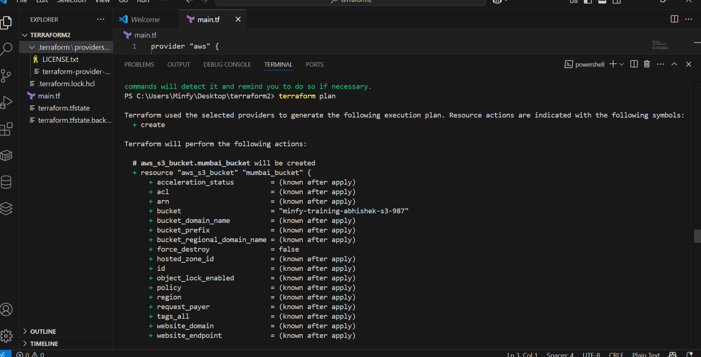
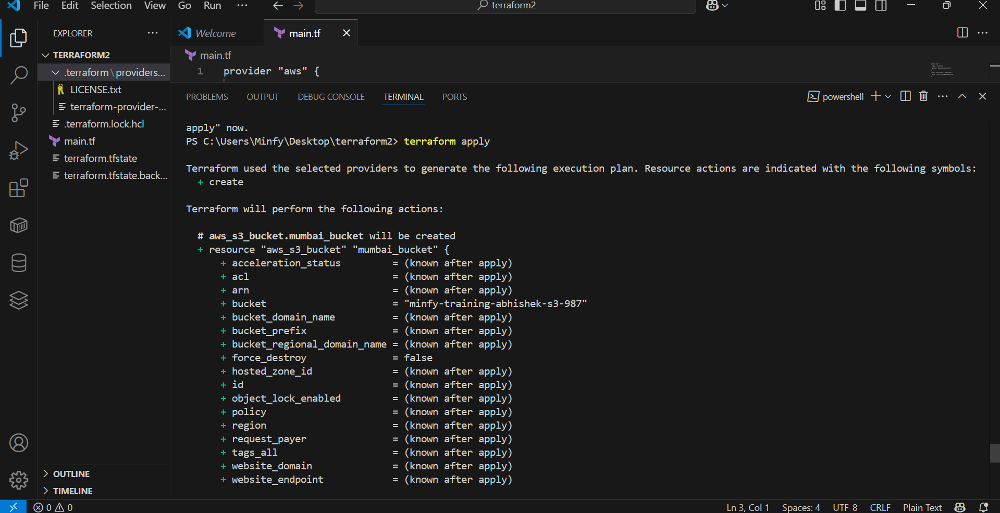
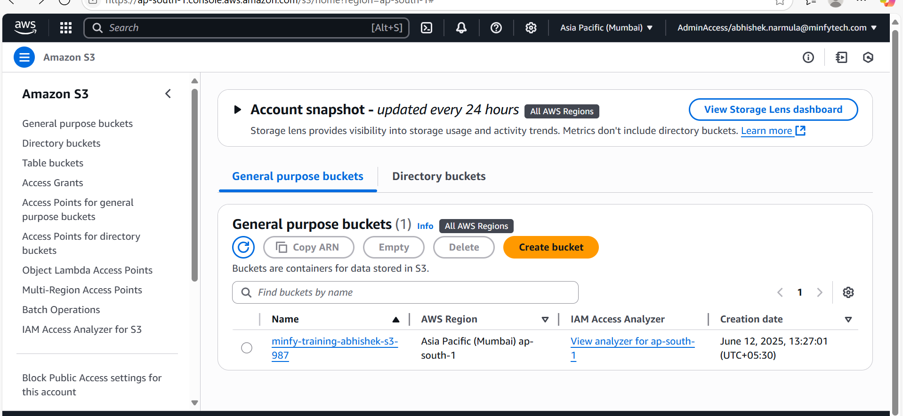
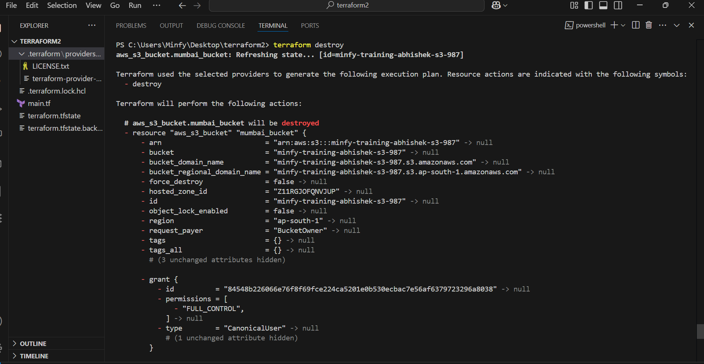

## creation of s3_bucket from terraform
## main.tf
create a terraform block in that 
create a provider = "aws"
region as "ap-south-1"
## s3_bucket
for creation of s3_bucket 
bucket_name = "minfy-training-abhishek-s3-987"

resource "aws_s3_bucket" "abhishek_s3_bucket" {
  bucket = "minfy-training-abhishek-s3-987"
}

## backend.tf
create a s3_backend 
bucket_name = "minfy-training-abhishek-s3-987"
region = "ap-south-1"
## terraform command 
1) terraform init

2) terraform plan

3) terraform apply

 
## created the s3_bucket

## to clean up
4) terraform destroy

