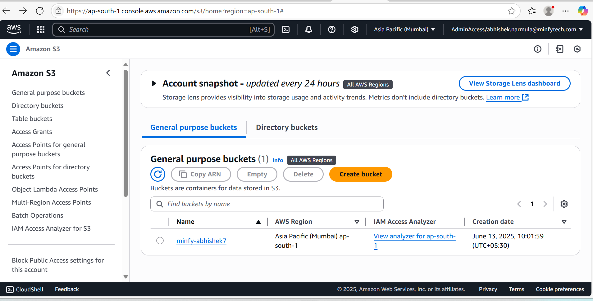
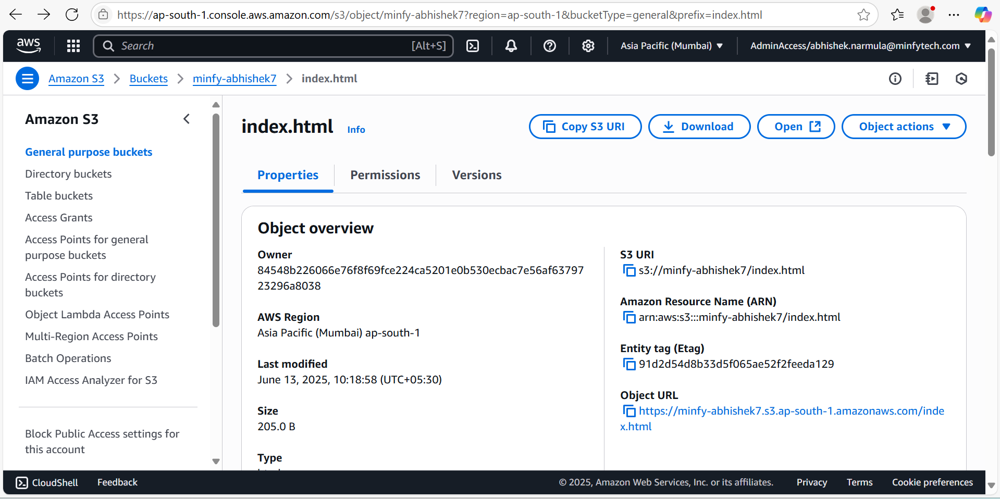
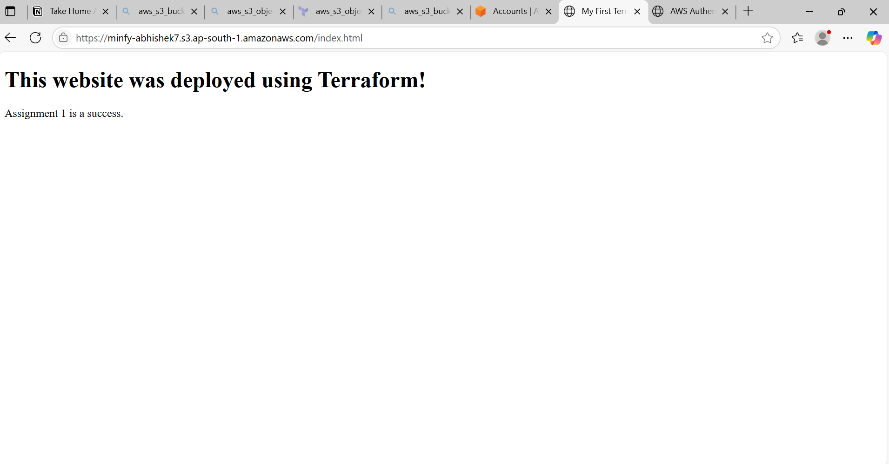

## Take home assignment 1 
## INDEX.HTML
 create a simple HTML file with name index.html
 <!DOCTYPE html>
<html>
<head>
  <title>My First Terraform Website</title>
</head>
<body>
  <h1>This website was deployed using Terraform!</h1>
  
Assignment 1 is a success.

</body>
</html>

## variable.tf
create variable.tf file 
in that file define aws_region 
and s3_bucket

## main.tf
1) firstly create a provider = "aws"
with region "ap-south-1"

then create a aws_s3_bucket 
bucket name as "minfy-abhishek7"

resource "aws_s3_bucket" "abhishek7"{
  bucket = "minfy-abhishek7"
}

2) then create a  "aws_s3_bucket_public_access_block"
and make changes as false 

  block_public_acls       = false
  block_public_policy     = false
  ignore_public_acls      = false
  restrict_public_buckets = false

3) "aws_s3_bucket_website_configuration"
with 
  index_document {
    suffix = "index.html"
  }

4) "aws_s3_bucket_policy" 
 Create a public read policy for the bucket. 
 policy that grants "s3:GetObject" permissions to everyone
  You can use the aws_iam_policy_document data source to build this policy in HCL

5) "aws_s3_object"
in this we need to define key and source which have the name has policy name 

## output.tf
create a output.tf file name as "website endpoint 
it has value in the value we need to define as  aws_s3_bucket_website_configuration.abhishek7.website_endpoint

